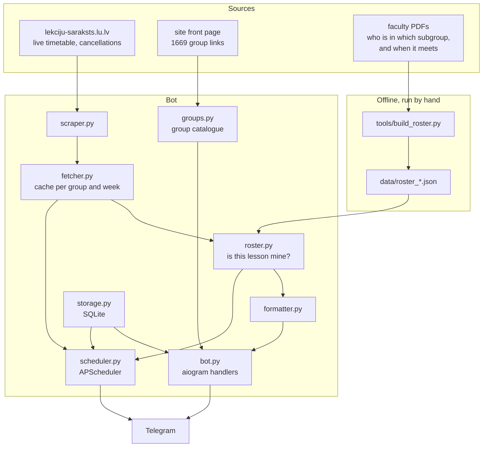
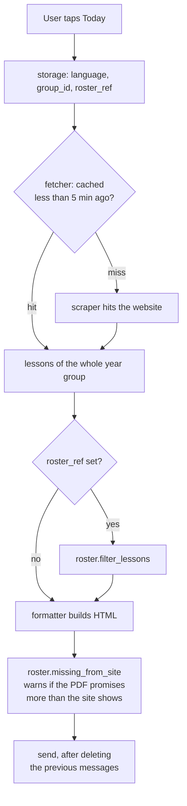
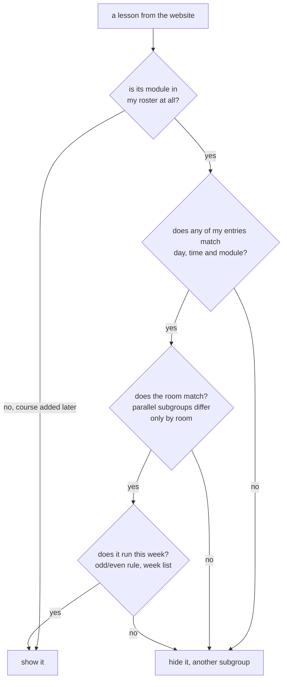
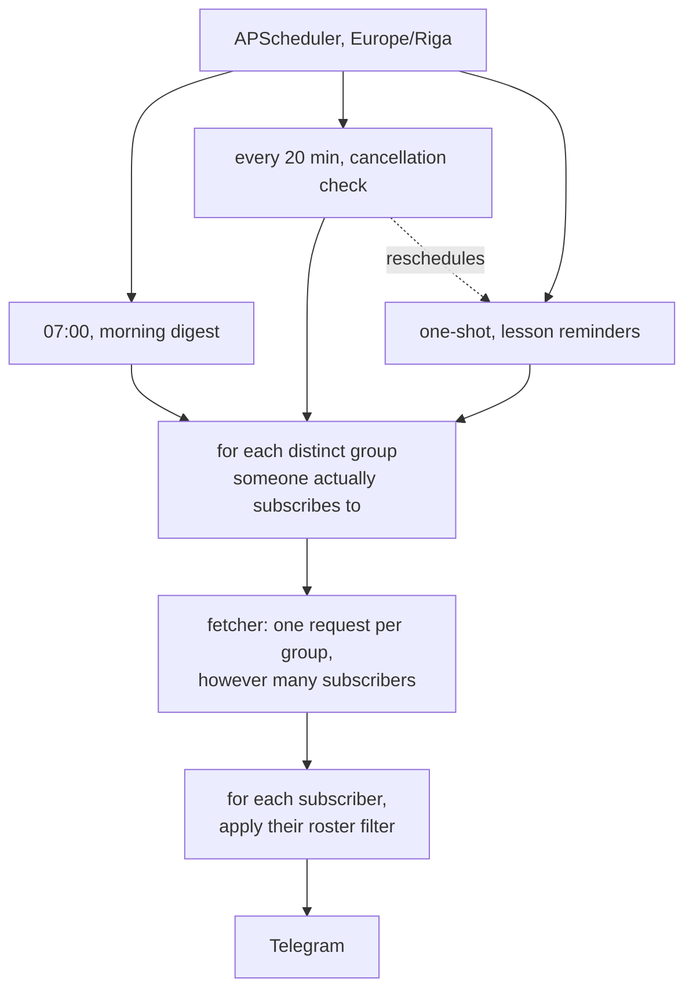
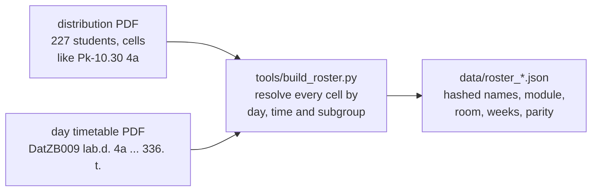

# LU Schedule Bot

A Telegram bot for **Latvijas Universitāte** students. It knows your timetable,
warns you when a class is cancelled, and nudges you before each one starts.

Its point of difference: the university website lists every parallel lab of an
entire year group and gives no hint which one is yours. This bot works that out
from the faculty's own distribution list, so you see **your** classes — shared
lectures plus your small groups — and nobody else's.

Scrapes [lekciju-saraksts.lu.lv](https://lekciju-saraksts.lu.lv) directly. No
third-party APIs, because there is no API.

---

## Features

- **Schedule on demand** — today, tomorrow, this week, next week
- **Your own subgroup** — find yourself in the distribution list and see only your classes: shared lectures plus your small groups (`4`, `4a`, `12`, `E`…)
- **Odd/even weeks** — honoured from the PDFs, since the website does not encode them at all
- **Any group** — all 1669 LU groups, searchable from inside the bot
- **Morning digest** — your day, sent at a configurable time
- **Cancellation alerts** — lesson states are polled and changes announced
- **Lesson reminders** — N minutes before each class, filtered to your subgroups
- **Gap warnings** — when the distribution list schedules a class the website is missing, the bot says so instead of quietly dropping it
- **Break times** — the gap between lessons, shown inline
- **3 interface languages** — Русский / English / Latviešu
- **Tidy chat** — the bot deletes its previous messages before sending new ones, so navigation does not pile up

---

## Preview

```
📅 Friday, 04.09.2026

┌ 12:30 – 14:10 ─ Practical works
│ 📚 Algoritmi un programmēšana
│ 🏛 18. auditorija (3. stāvs), Raiņa bulvāris 19
└ 👤 Edgars Rencis

⚠️ The distribution list gives you a class here that the website does not show:
• 10:30 DatZB009 group 4a, 336.
```

---

## How it works

### The whole picture



### Answering "what do I have today?"



### Deciding whether one lesson is yours

This is the core of the whole project. It errs towards showing too much: an
extra class on screen is an annoyance, a missing one is a missed class.



### Background jobs



Reminders are rescheduled on every cancellation check, so someone who picks a
group at 10:00 does not have to wait until tomorrow morning for them.

### Building the roster



Each cell of the distribution table is a coordinate — `Pk-10.30 (4a)` means
Friday, 10:30, subgroup 4a — and the day timetable turns that coordinate into a
module code, a room and a week rule. All 2886 cells of all 227 students resolve.

---

## Subgroups

The website has no subgroup marker anywhere in its data; every parallel lab of
the year looks identical apart from room and teacher. The faculty publishes the
missing half separately, as two PDFs. Fold them together and you get a personal
timetable.

```bash
pip install -r requirements-dev.txt
python tools/build_roster.py \
    --students 1kurss_2026R_sad_gr_07-PUBL.pdf \
    --days     2026R_DN_LV_09.pdf \
    --out      data/roster_2026R_1kurss.json
```

Students then press **My subgroups**, type their surname and pick themselves
from the matches. Each match is labelled by number, stream and subgroups —
`№105 · pl. I · 4, 4a, 12, E` — which is enough to recognise yourself.

Two things come from the PDFs because the website simply does not encode them:

- **odd/even weeks** — `2.Pk-14.30` means *even weeks only*; the site shows that slot every week regardless of whose turn it is
- **explicit week lists** — `5., 8., 10., 14., 16. ned.`

Week numbering was verified against the live site rather than assumed: those web
labs do appear in weeks 5 and 8 and in none of the weeks between.

### Names are not stored

The roster keeps salted hashes of each name token, never the names. Searching by
surname still works — the query is hashed and compared — while the repository
carries no class list in plain text.

For a known cohort of 227 people this is obfuscation, not anonymity: anyone with
a list of Latvian surnames could grind through the hashes. It is meant to stop
casual copying, and nothing stronger should be read into it.

---

## Commands

| | |
|---|---|
| `/start` | Subscribe, pick a language, open the menu |
| `/me` | Find yourself in the distribution list and set your subgroups |
| `/group` | Search and change your year group |
| `/language` | Switch between Русский / English / Latviešu |
| `/about` | Author and disclaimer |
| `/stop` | Unsubscribe from notifications |

---

## Getting Started

### 1. Clone the repository

```bash
git clone https://github.com/Fek1r/LU_TGBOT_Schedule.git
cd LU_TGBOT_Schedule
```

### 2. Create a Telegram bot

1. Open [@BotFather](https://t.me/BotFather) and send `/newbot`
2. Follow the instructions and copy the token (`123456789:ABC-DEF...`)

### 3. Configure environment

```bash
cp .env.example .env
```

Fill in `.env`:

```env
TELEGRAM_BOT_TOKEN=your_token
GROUP_ID=26R-22302-PLK-1        # default group for new subscribers; each one can change it in the bot
MORNING_NOTIFY_TIME=07:00       # time to send the morning digest
REMINDER_MINUTES_BEFORE=15      # how many minutes before class to remind
CHECK_INTERVAL_MINUTES=20       # how often to check for cancellations
DEFAULT_LANGUAGE=ru             # fallback language: ru / en / lv
TIMEZONE=Europe/Riga            # the university's timezone, not the server's
SEMESTER_START=2026-08-31       # Monday of week 1 — the odd/even rules depend on it
DB_PATH=bot.db                  # put this on a persistent volume in production
```

> The group ID appears in the URL on lekciju-saraksts.lu.lv, e.g. `26R-22302-PLK-1`.
> `TIMEZONE` matters: a container running on UTC would otherwise send the 07:00
> digest at 10:00 Riga time and remind you after your class had started.

### 4. Install dependencies

```bash
python -m venv venv
source venv/bin/activate      # Windows: venv\Scripts\activate
pip install -r requirements.txt
```

### 5. Run

```bash
python main.py
```

Open the bot in Telegram and send `/start`: pick a language, then `/group` if you
are not in the default one, then `/me` to narrow it down to your subgroups.

---

## Deployment

### Railway

Connect the repository, and check **Settings → Source** actually points at the
`master` branch — a mismatch there is silent, and pushes simply never deploy.

**Attach a volume and point `DB_PATH` at it**, for example `/data/bot.db`. The
container filesystem is ephemeral: without a volume every deploy wipes the
subscriber table, and everyone has to `/start`, re-pick their group and re-pick
their subgroups.

### systemd

Create `/etc/systemd/system/lu-bot.service`:

```ini
[Unit]
Description=LU Schedule Telegram Bot
After=network.target

[Service]
Type=simple
User=your_user
WorkingDirectory=/path/to/lu-schedule-bot
ExecStart=/path/to/lu-schedule-bot/venv/bin/python main.py
Restart=on-failure
RestartSec=10

[Install]
WantedBy=multi-user.target
```

```bash
sudo systemctl daemon-reload
sudo systemctl enable lu-bot
sudo systemctl start lu-bot
journalctl -u lu-bot -f   # view logs
```

### macOS

`launchd.plist` in the repository root runs the bot with `KeepAlive`, which
survives closing the terminal. Installation instructions are inside the file.

> Run **one** instance. Two pollers on the same token make Telegram terminate one
> of them with a 409, and the bot then answers roughly every other tap.

---

## Project Structure

```
lu-schedule-bot/
├── main.py              — entry point, polling loop
├── config.py            — settings from .env, timezone-aware now() and today()
├── scraper.py           — parses lekciju-saraksts.lu.lv into Lesson objects
├── fetcher.py           — cached, de-duplicated access to the scraper
├── groups.py            — the catalogue of 1669 groups: search and cache
├── roster.py            — who sits in which small group, and when
├── storage.py           — SQLite: subscribers, group, roster pin, lesson states
├── formatter.py         — language-aware message formatting
├── locales.py           — UI strings (ru / en / lv)
├── scheduler.py         — APScheduler: digest, cancellations, reminders
├── bot.py               — aiogram handlers, inline navigation
├── msg_tracker.py       — remembers what to delete before the next message
├── data/                — rosters built from the faculty PDFs
├── tools/               — build_roster.py: PDF to JSON, run by hand
├── launchd.plist        — optional macOS service
├── .env.example         — environment variables template
├── requirements.txt
└── requirements-dev.txt — pypdf, only needed to rebuild a roster
```

---

## Stack

| | |
|---|---|
| Bot framework | [aiogram 3.x](https://github.com/aiogram/aiogram) |
| Scheduler | [APScheduler 3.x](https://apscheduler.readthedocs.io) |
| Database | SQLite via [aiosqlite](https://github.com/omnilib/aiosqlite) |
| Scraping | [requests](https://requests.readthedocs.io) + [BeautifulSoup4](https://www.crummy.com/software/BeautifulSoup/) |
| PDF parsing | [pypdf](https://github.com/py-pdf/pypdf), offline only |

---

## Disclaimer

A study project, built for educational and recreational purposes by
**Sergejs Krasikovs**.

The data comes from lekciju-saraksts.lu.lv and the faculty's PDFs, and may not
match reality: schedules get changed, the site occasionally lies, the bot
occasionally sleeps. No guarantee of accuracy, no responsibility for missed
classes. Check anything important on the official site.
